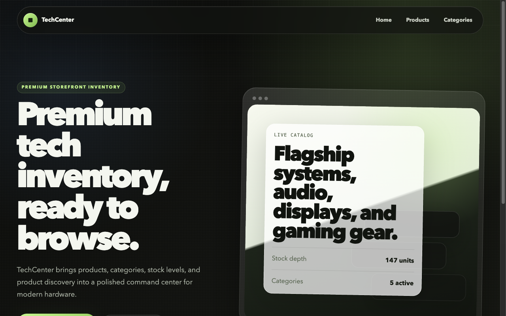

# Inventory App (TechCenter)

A server-rendered inventory manager built to practice **Express and PostgreSQL** —
category/product browsing, detailed item pages, server-side validation, and a
password-protected delete flow, with EJS views styled by Tailwind.

🔗 **Live demo:** [inventory-app-rho-ivory.vercel.app](https://inventory-app-rho-ivory.vercel.app/)



## Features

- Category and product controllers for browsing grouped inventory.
- PostgreSQL-backed queries for persistent products, categories, and details.
- Create/edit flows with `express-validator` server-side validation.
- Password-protected delete confirmation for safer destructive actions.

## Tech stack

Node.js · **Express** · **PostgreSQL** (`pg`) · EJS · `express-validator` · Tailwind CSS

## Getting started

```bash
npm install
# configure environment (see below), then initialize the database schema:
npm run db:init
npm run dev          # Express server + Tailwind watch (concurrently)
```

Production-style start: `npm start` (serves `routes/app.js`).

### Environment variables

Set in a local `.env` (gitignored). Variable **names** only:

| Variable | Used for |
|---|---|
| `POSTGRES_URL` | PostgreSQL connection string |
| `ADMIN_PASS` | Password gating destructive (delete) actions |
| `PORT` | Server port (optional) |

## Project structure

`routes/` (Express app + routes), `controllers/`, `db/` (schema init + queries),
`views/` (EJS), `public/` (compiled Tailwind CSS), `src/input.css` (Tailwind source).

## What I practiced

Building a full **server-rendered CRUD** app on Express + Postgres, parameterized SQL
queries, server-side validation, and gating destructive operations behind a password.

## License

Odin Project coursework — original implementation by Aziz Umarov.
